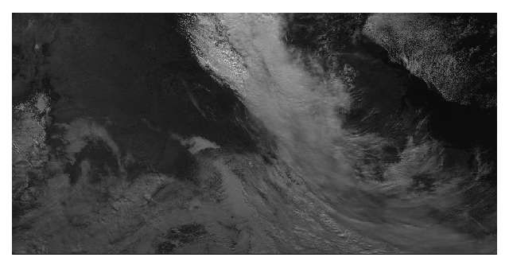

<div align="center"></img></div>

<h1 align="center">Solar Irradiance Prediction</h1>

<p align="center">
    <a href="https://travis-ci.com/psf/black"></a>
    <a href="https://github.com/psf/black"></a>
</p>


## Setup

To keep the code clean and consistent, some linters are in place.

- `flake8` Ensure pep8 standards and check some syntax errors.
- `mypy` Ensure there is no type error.
- `pydocstyle` Ensure the same documentation format is used across the project.
- `black` Ensure the same code formatting is used across the project.

### Vs Code User

Defaults VsCode settings can be installed.

```bash
cp .vscode/settings.default.json .vscode/settings.json
```

### Image dimension
All the images have dimension 650x1500

### Stations Pixel Location (Mauvaise localisation?)
- BND: X = 688, Y = 188
- TBL: X = 371, Y = 186
- DRA: X = 169, Y = 252
- FPK: X = 374, Y = 33
- GWN: X = 660, Y = 296
- PSU: X = 883, Y = 174
- SXF: X = 533, Y = 118

## Important paths.
| Tables        | Are           |
| ------------- |:-------------:|
| /project/cq-training-1/project1/teams/team10                   | Team bastpath |
| /project/cq-training-1/project1/teams/team10/image_reader_cache  | Directory where all the pickled images for the image reader cache are stored for the team.      |
| /localscratch/guestXXX.JOBID.0/         | SSD location when training on the cluster.    |
| /project/cq-training-1/project1/submissions/team10 |    Submission folder for evaluation.  |

## Samples

## Running

### Training

To train a model, you can use the script `run_model.py`.
On helios, you can either use `./scripts/run_model_cached.sh` or `./scripts/run_model.sh` with the same arguments.

A few examples:

```sh
python run_model.py --model Conv2D --train --lr 0.001 --skip_non_cached 
python run_model.py --model Conv3D --train --epochs 2 --seed 1234
```

### Testing

To test a model on the test set, the same script can be used.
The only difference is that you have to pass to argument `--test {checkpoint}`

An example while testing the Conv2D model with the 4th checkpoint.
```sh
python run_model.py --model Conv2D --test 4
```

## Samples
Each gif has 10 images with 30 minute intervals between them on all channels.

<div align="center">
    </img>
    </img>
    </img>
    </img>
    </img>
</div>

<div align="center">
    </img>
    </img>
    </img>
    </img>
    </img>
</div>


