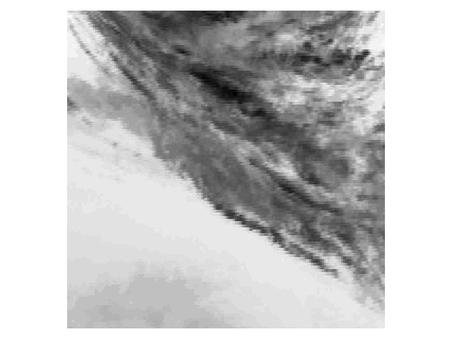

# Solar-Irradiance-Prediction


<div align="center"></img></div>

## Setup

To keep the code clean and consistent, some linters are in place.

- `flake8` Ensure pep8 standards and check some syntax errors.
- `mypy` Ensure there is no type error.
- `pydocstyle` Ensure the same documentation format is used across the project.
- `black` Ensure the same code formatting is used across the project.

### Vs Code User

Defaults VsCode settings can be installed.

```bash
cp .vscode/settings.default.json .vscode/settings.json
```

### Image dimension
All the images have dimension 650x1500

### Stations Pixel Location (Mauvaise localisation?)
- BND: X = 688, Y = 188
- TBL: X = 371, Y = 186
- DRA: X = 169, Y = 252
- FPK: X = 374, Y = 33
- GWN: X = 660, Y = 296
- PSU: X = 883, Y = 174
- SXF: X = 533, Y = 118

## TensorBoard

You can view the tensorboard interactivly on `helio` by creating a ssh bridge.
For example, given a tensorboard file `/path/to/tensorboard/file_dir` on port `8008`.

```bash
ssh -L 8008:localhost:8008 helios
```
Then run the script which will make the tensorboard available at `localhost:8008`.

```bash
scripts/tensorboard.sh /path/to/tensorboard/file_dir 8008`.
```
## Important paths.
| Tables        | Are           |
| ------------- |:-------------:|
| /project/cq-training-1/project1/teams/team10                   | Team bastpath |
| /project/cq-training-1/project1/teams/team10/tensorboard          | Tensorboard Log Directory      |
| /project/cq-training-1/project1/teams/team10/image_reader_cache  | Directory where all the pickled images for the image reader cache are stored for the team.      |

## Samples

Each gif has 10 images with 30 minute intervals between them on all channels.

<div align="center">
    </img>
    </img>
    </img>
    </img>
    </img>
</div>

<div align="center">
    </img>
    </img>
    </img>
    </img>
    </img>
</div>


